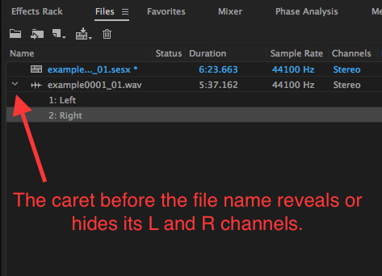
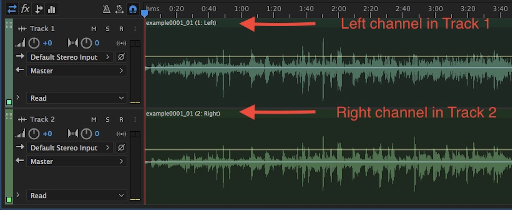
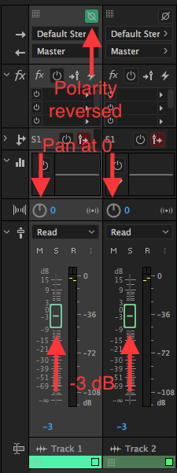

## Rendering mono Presentation files from Audio Preservation Master files of lateral-cut mono discs.

Audio Preservation Master files of mono, lateral-cut analog discs (shellac, vinyl, lacquer, etc.) are produced by transfering and capturing the disc's signal in the "stereo" mode.  This method produces discrete signals from the disc's left and right groove walls in the file's left and right channels, and allows restorers the opportunity to perform specific digital signal processes --including phase correction-- that would be impossible had the discs been transfered in the "mono" mode.

The following workflow for processing an a disc's Preservation Master file will optimize its lateral signal, eliminate any vertical signal, reduce phase problems which may have occured in the cutting or transfer of the disc, and will render a 2-channel file with a mono soundfield.

The Digital Audio Workstation illustrations in the following workflow description have been taken from Adobe Audition CC, 10.1.1.11  

### Workflow

1)	Load the Preservation Master file into the DAW

2)	Run the phase correction process on the Preservation Master file, as needed.   

File example with the Left and Right channels revealed.

  

Multitrack example with the files Right channel in Track 1 and its Left channel in Track 2.    

3)	Put the new phase-corrected file’s Left channel in the first track of the multi-track DAW:  

* pan the track’s mixer strip to the center, or 0, position  
* lower the track’s mixer strip to -3db.

4)	Put the phase corrected file’s Right channel in the second track of the multi-track DAW: 

* pan the track’s mixer strip to the center, or 0, position  
* lower the track’s mixer strip to -3db.   

5)	Reverse the polarity on the Track 1's mixer strip; leave the polarity of Track 2's mixer strip in the normal position.   

Mixer strip example with adjustments made to the polarity, panning, and level.   

6)	Play the file and nudge the fader gain, plus or minus tenths of a dB, on Track 1's mixer strip until the resulting output of the mixed L and R signal is as near to null as possible [Ideally, this this adjustment will completely cancel the lateral component of the signal, leaving only the vertical component –which is mostly rumble, noise, and some clicks and pops].

7)	Return the polarity to the normal position on Track 1's mixer strip.  Leave Track 1's fader at the setting made in step 6 above. [Ideally, this new balance will completely cancel the vertical component of the signal, and optimize the lateral component of the signal –which is the intended signal].

8)	Render a new 2-channel mono file from the mix

9)	Continue with other restoration signal processes (de-click, etc.) as needed
